# Aether Zakelijk — Productspecificatie

| | |
|---|---|
| **Product** | Aether Zakelijk (zakelijk portaal voor aangesloten zaken) |
| **Versie document** | 1.0 — concept ter goedkeuring |
| **Datum** | 5 oktober 2026 |
| **Status** | **Gebouwd als demo (app-versie 0.9.0).** Hoofdstuk 14 beschrijft wat er staat en waarin het van dit ontwerp afwijkt. De screenshots in hoofdstuk 5 zijn de oorspronkelijke ontwerp-mockups (`mockups/`); echte schermen van de app staan in `screenshots/app/` |
| **Hoort bij** | `docs/SPEC.md` (app), `docs/PLAN.md` (plan, demo-modus) |
| **Taal** | UI Nederlands, code en commit-berichten Engels |

---

## 1. Samenvatting

Aether helpt groepen de eerlijkste ontmoetingsplek te vinden. Tot nu toe kijkt alleen de **groep** naar de app. **Aether Zakelijk** voegt de andere kant toe: de **zaak** (restaurant, café, hotel, vergaderzaal) die in Aether wordt voorgesteld.

Een aangesloten zaak krijgt een eigen portaal met:

1. **Overzicht en statistieken** — hoeveel groepen kozen mijn zaak, hoe vaak werd ik getoond, waar komen groepen vandaan, hoe eerlijk is de reistijd voor hen.
2. **Zaakprofiel** — openingstijden, diensten, capaciteit, dieetopties: precies de velden die Aether al gebruikt om te filteren.
3. **Reserveringsaanvragen** van groepen.
4. **Abonnementen** in vijf stappen (Basis → Keten): hoe meer je betaalt, hoe ruimer de bundel aan diensten.
5. **Facturen en team** (wie in de zaak mag wat).

**Ontwerpprincipe dat alles bepaalt: betalen koopt nooit een hogere plek.** De ranglijst en de fairness-score blijven puur op reistijd en wensen van de groep gebaseerd. Een betaald abonnement geeft *inzicht, gemak en zichtbaarheid in een apart, duidelijk gelabeld blok*. Dat past bij het merk ("eerlijkste plek") en voorkomt dat de kernbelofte van Aether kapot gaat.

> **Demo-eerst.** Conform het goedgekeurde plan (PLAN §2) werkt de eerste versie net als de rest van de app: alle data is fictief, er is geen echte betaling, geen server. Het abonnement is een *label* dat functies aan- of uitzet, zoals het Plus-label nu al doet. Dit document beschrijft zowel die demo als het echte product erachter.

---

## 2. Doelgroep, doelen en niet-doelen

**Doelgroep:** lokale ondernemers met een zaak die groepen ontvangen — restaurants, cafés, bars, hotels, vergaderzalen, evenementlocaties. Eén eigenaar of een klein team, weinig tijd, geen data-analist.

| Doel | Meetbaar |
|---|---|
| Een ondernemer ziet binnen 10 seconden hoe zijn zaak het doet | Overzicht toont 4 kerncijfers zonder scrollen |
| Een zaak sluit zich in minder dan 5 minuten aan | Onboarding in 4 stappen |
| Een zaak snapt wat een hoger abonnement oplevert | Eén vergelijkingsscherm, geen kleine lettertjes |
| Groepen blijven eerlijk geholpen | Rangorde is onafhankelijk van abonnement (test in `npm test`) |

**Niet-doelen (nu):** echte betalingen (Stripe/iDEAL), echte e-mails, kassakoppelingen, advertentieveiling, publieke API. Deze staan op de lijst "Buiten scope" of komen pas in latere fases.

---

## 3. Twee besluiten vóór we bouwen (belangrijk)

### 3.1 Statistieken versus privacy en "geen backend"

De kern van Aether is: *geen account, geen tracking, alles lokaal, hosting alleen statisch*. Maar "hoeveel groepen kozen mijn zaak" kan **alleen** weten als iemands keuze ergens wordt geteld. Dat botst met de huidige stack.

| Optie | Hoe | Voor | Tegen |
|---|---|---|---|
| **A. Demo-statistieken (aanbevolen nu)** | Alle cijfers worden deterministisch gegenereerd uit fictieve data in de repo, zoals `data/venues.json` | Past 100% in huidige stack en plan; geen privacyvraag; direct te bouwen en te laten zien | Cijfers zijn niet echt |
| **B. Anonieme tellingen met kleine backend** | App stuurt, alleen na opt-in, een anonieme teller ("zaak X gekozen, groepsgrootte 6, reistijdklasse 20–30") naar een klein server-endpoint | Echte cijfers | **Vereist backend** (volgens CLAUDE.md: eerst vragen); privacy-keuze, AVG-verwerkersovereenkomst |
| **C. Zaak-gemeld** | Zaak scant/telt zelf (promocode of QR bij bezoek) | Geen tracking van gebruikers | Weinig volume, nog steeds opslag nodig |

**Voorstel:** A voor Z0–Z4; B pas na uw uitdrukkelijk akkoord als apart traject, met deze privacy-regels: opt-in, geen persoons- of adresgegevens, alleen geaggregeerd, **minimaal 5 keuzes per getoonde groep (k-anonimiteit)**, geen koppeling tussen gebruikers.

### 3.2 Het abonnement en geld

Echt betalen vraagt een betaalpartij en dus een backend of hosted checkout. De spec (SPEC §2) noemt Stripe Payment Links; PLAN §2 en CLAUDE.md zeggen: Stripe/paywall is buiten scope, alleen een label als demo. Dit document volgt dat: **het abonnement is in de demo een gesimuleerd label.** Echte betaling is fase Z5 en vereist uw akkoord.

---

## 4. Rollen en toegang

| Rol | Mag |
|---|---|
| **Eigenaar** | Alles, inclusief abonnement, facturen, opzeggen, rollen wijzigen |
| **Beheerder** | Zaakprofiel, aanvragen, statistieken, team uitnodigen (geen facturen/abonnement) |
| **Alleen lezen** | Statistieken en aanvragen bekijken |

Een zaak zonder abonnement heeft het plan **Basis** (gratis). Rollen worden in de demo lokaal bewaard; in het echte product komen ze uit een inlogdienst (zie §9.9).

---

## 5. Schermen en gedrag

Navigatie: zijbalk op de computer, onderbalk op de telefoon (grens 900 px), net als de bestaande app. Modules: **Overzicht · Statistieken · Mijn zaak · Aanvragen · Abonnement · Facturen · Team & rechten**. Alle teksten Nederlands, kleuren uit `css/tokens.css`.

### 5.1 Zaak aansluiten (onboarding)

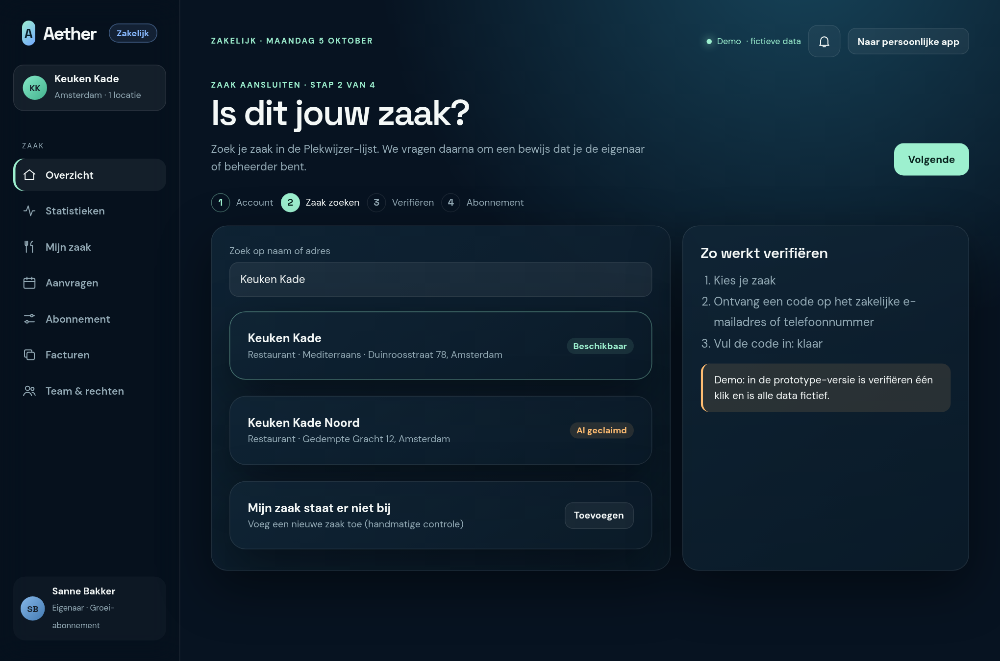

Vier stappen: **Account → Zaak zoeken → Verifiëren → Abonnement**.

- De zaak wordt gezocht in de bestaande Plekwijzer-lijst (`data/venues.json`). Zo hoeft een ondernemer niets over te typen: type, adres, openingstijden en diensten bestaan al.
- Staat de zaak er niet bij, dan "Toevoegen (handmatige controle)".
- Is een zaak al geclaimd: melding "Al geclaimd" en mogelijkheid om contact op te nemen.
- **Verifiëren:** code naar zakelijk e-mailadres of telefoonnummer. In de demo is dit één klik.
- Eindstap: kies een abonnement (standaard Basis, gratis).

### 5.2 Overzicht

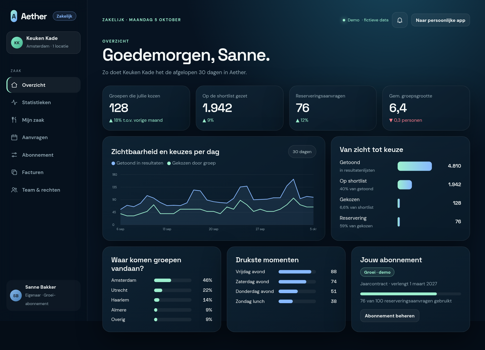

Eerste scherm na inloggen. Van boven naar beneden:

1. **4 kerncijfers** met trend t.o.v. vorige periode: groepen die de zaak kozen, op de shortlist gezet, reserveringsaanvragen, gemiddelde groepsgrootte.
2. **Lijngrafiek** getoond vs. gekozen per dag (30 dagen). Tekstalternatief met samenvatting voor schermlezers.
3. **Trechter** "Van zicht tot keuze": Getoond → Op shortlist → Gekozen → Reservering, met conversiepercentages.
4. **Herkomst** (steden), **drukste momenten**, **abonnementskaart** met gebruiksmeter.

Telefoon-versie (onderbalk, kerncijfers 2×2, aanvragen bovenaan omdat dat de actie is):

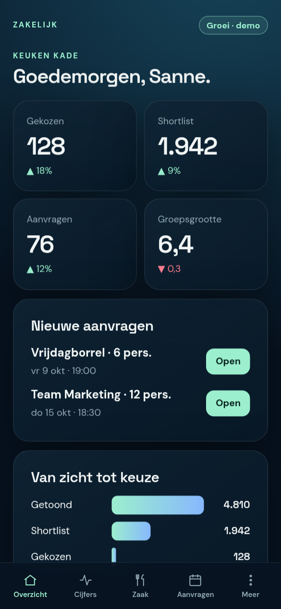

### 5.3 Statistieken

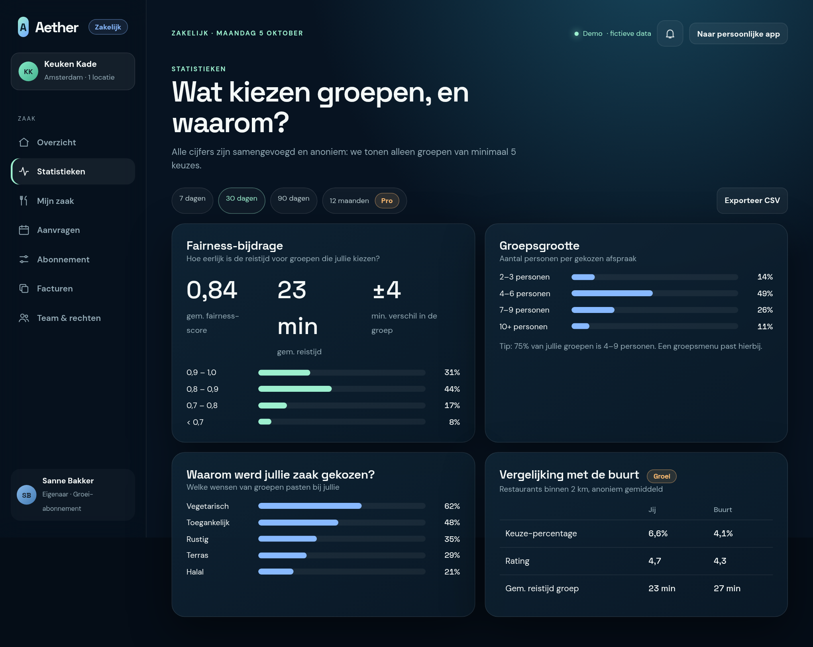

Periode-chips 7 / 30 / 90 dagen / 12 maanden; CSV-export. Panelen:

| Paneel | Toont | Minimaal plan |
|---|---|---|
| Aantal keren gekozen (30 dagen) | Eén getal + trend | Basis |
| Fairness-bijdrage | Gem. fairness-score, reistijd, spreiding | Start |
| Groepsgrootte | Verdeling in klassen | Start |
| Waarom gekozen | Welke wensen pasten (vegetarisch, toegankelijk, …) | Groei |
| Herkomst en tijdstippen | Steden, dag/dagdeel | Groei |
| Vergelijking met de buurt | Anoniem gemiddelde van vergelijkbare zaken binnen 2 km | Groei |
| 12 maanden historie, CSV, API | | Pro |

Elke grafiek heeft een kopje dat de conclusie geeft en een kleine "Tip" in gewoon Nederlands (bijv. "75% van jullie groepen is 4–9 personen. Een groepsmenu past hierbij.").

### 5.4 Mijn zaak

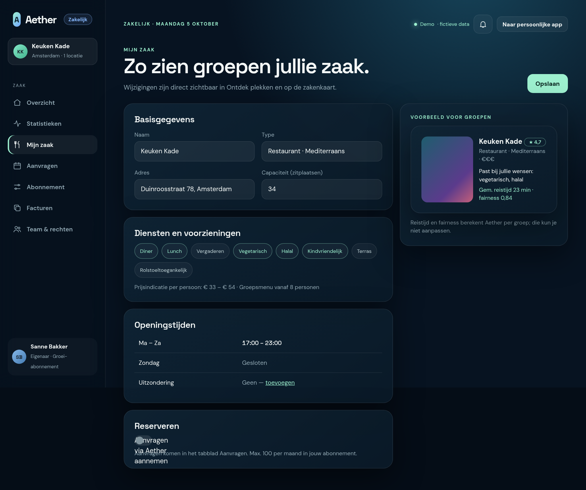

Formulier links, **live voorbeeld rechts** zoals groepen de zaak zien. Velden komen overeen met het bestaande venue-model, zodat wijzigingen direct in "Ontdek plekken" zichtbaar zijn:

`name, type, cuisine, address, capacity, hours[7], services[], diets[], price_range, terrace, kid_friendly, dog_friendly, parking, charger, accessible, accessible_toilet, quiet, vegetarian, photos`.

Reistijd en fairness zijn berekend per groep en **niet** bewerkbaar (staat expliciet in het scherm). Foto's: in de demo gegenereerde SVG-verlopen, later upload (limiet per plan).

### 5.5 Aanvragen

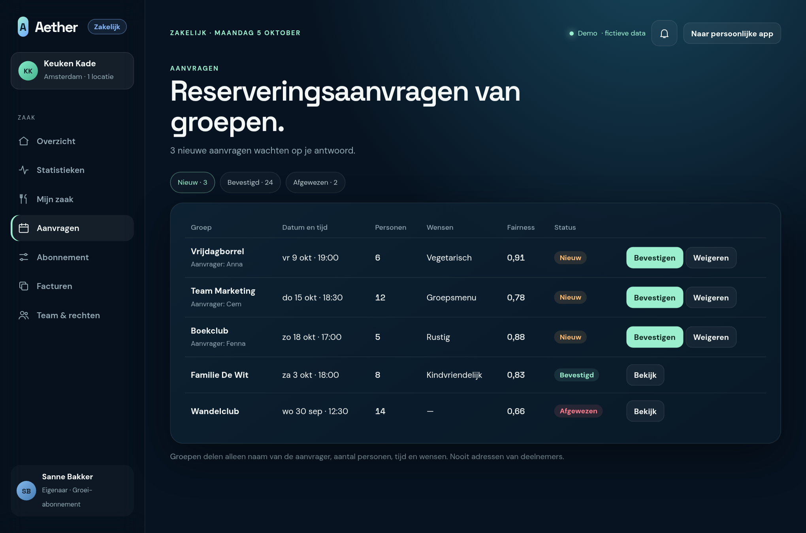

Groepen die via de boekflow een reservering aanvragen komen hier binnen (tabs Nieuw / Bevestigd / Afgewezen). De zaak ziet alleen: groepsnaam, naam van de aanvrager, tijd, aantal personen, wensen en de fairness-score. **Nooit** de adressen van deelnemers. Bevestigen stuurt de groep een bevestiging (demo: melding in Activiteit en `.ics`; later e-mail).

### 5.6 Abonnement

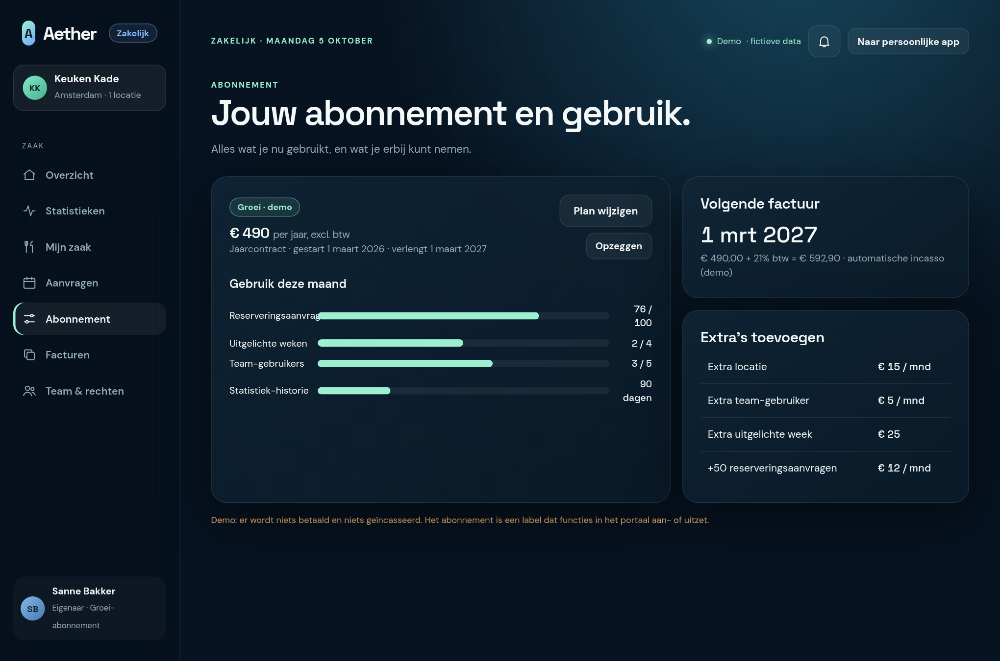

Toont huidig plan, contractvorm, verlengdatum, **gebruiksmeters** (aanvragen, uitgelichte weken, gebruikers, historie), volgende factuur en losse extra's. Knoppen: Plan wijzigen, Opzeggen. Zie §6 voor alle regels.

### 5.7 Abonnement kiezen

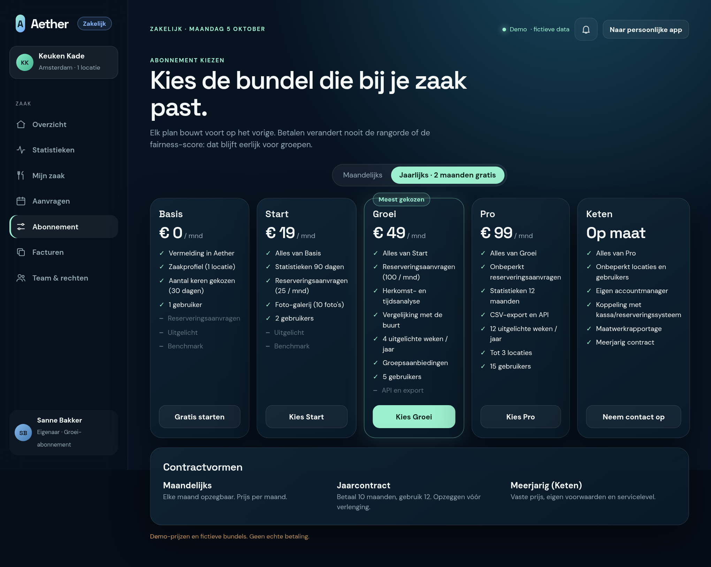

Vijf kaarten naast elkaar (op telefoon onder elkaar), schakelaar Maandelijks / Jaarlijks (2 maanden gratis), contractvormen eronder. Het huidige plan is gemarkeerd, het aanbevolen plan ("Meest gekozen") krijgt de glow. Bij kiezen van een lager plan: toon wat er verdwijnt, vóór bevestigen.

### 5.8 Facturen

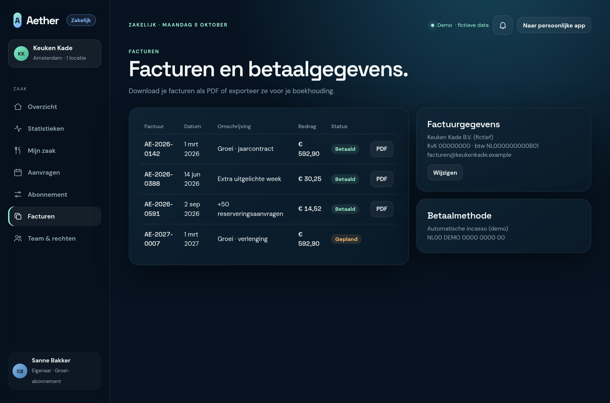

Lijst met factuurnummer, datum, omschrijving, bedrag (incl. btw) en status; PDF per factuur; factuurgegevens en betaalmethode. In de demo zijn de facturen fictief en is "PDF" een eenvoudige printbare pagina.

### 5.9 Team & rechten

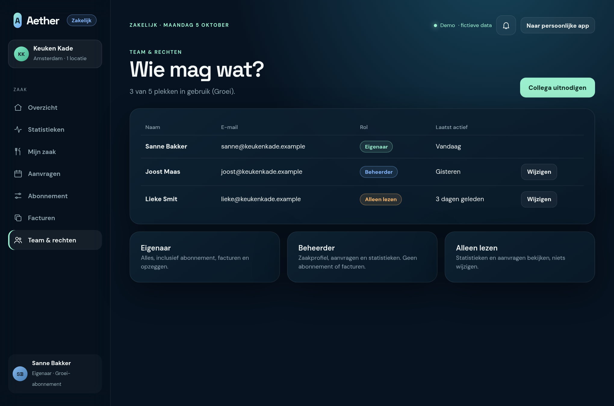

Collega's uitnodigen per e-mail (demo: link kopiëren), rol kiezen, rollen wijzigen. Het aantal plekken hangt af van het plan.

---

## 6. Abonnementssysteem (fictief, uitgewerkt)

Alle bedragen zijn **demo-bedragen, excl. 21% btw**. Elk plan bevat alles van het vorige plan.

### 6.1 Plannen

| | **Basis** | **Start** | **Groei** | **Pro** | **Keten** |
|---|---|---|---|---|---|
| Prijs per maand | € 0 | € 19 | € 49 | € 99 | Op maat (vanaf € 249) |
| Prijs per jaar (10 × maand) | € 0 | € 190 | € 490 | € 990 | Op maat |
| Voor wie | Eerst proberen | Kleine zaak | Drukke zaak | Zaak met meer locaties | Ketens, hotelgroepen |
| **Zichtbaarheid** | | | | | |
| Vermelding in Aether | ✓ | ✓ | ✓ | ✓ | ✓ |
| Zaakprofiel | 1 locatie | 1 | 1 | tot 3 | onbeperkt |
| Foto's | 3 | 10 | 25 | 50 | onbeperkt |
| Uitgelichte weken per jaar¹ | – | – | 4 | 12 | 26 |
| **Inzicht** | | | | | |
| Aantal keren gekozen | 30 d | 90 d | 90 d | 12 mnd | 12 mnd+ |
| Fairness, groepsgrootte | – | ✓ | ✓ | ✓ | ✓ |
| Herkomst, tijdstippen, "waarom gekozen" | – | – | ✓ | ✓ | ✓ |
| Vergelijking met de buurt | – | – | ✓ | ✓ | ✓ |
| CSV-export | – | – | – | ✓ | ✓ |
| API / webhooks (alleen lezen) | – | – | – | ✓ | ✓ |
| **Reserveren** | | | | | |
| Reserveringsaanvragen per maand | – | 25 | 100 | onbeperkt | onbeperkt |
| Groepsaanbiedingen² | – | – | ✓ | ✓ | ✓ |
| Vergaderzaal-module (dagdelen, apparatuur) | – | – | – | ✓ | ✓ |
| **Samenwerken en service** | | | | | |
| Gebruikers | 1 | 2 | 5 | 15 | onbeperkt |
| Ondersteuning | Help-pagina | E-mail (3 werkdagen) | E-mail (1 werkdag) | Chat + telefoon | Eigen accountmanager |
| Koppeling kassa/reserveringssysteem | – | – | – | – | ✓ |
| Maatwerkrapportage | – | – | – | – | ✓ |

¹ **Uitgelicht** = de zaak verschijnt in een apart blok met label "Uitgelicht", onder of naast de eerlijke ranglijst. Het verandert de ranglijst, fairness-score en reistijd **niet**.
² Bijvoorbeeld "Groepsmenu vanaf 8 personen" of "Gratis welkomstdrankje op doordeweekse dagen". Verschijnt als label op de zakenkaart.

### 6.2 Extra's (bij elk betaald plan)

| Extra | Prijs |
|---|---|
| Extra locatie | € 15 / maand |
| Extra gebruiker | € 5 / maand |
| Extra uitgelichte week | € 25 per week |
| +50 reserveringsaanvragen | € 12 / maand |

### 6.3 Contractvormen

| Vorm | Regels |
|---|---|
| **Maandelijks** | Elke maand opzegbaar; opzeggen werkt aan het einde van de lopende maand |
| **Jaarcontract** | 10 maanden betalen, 12 gebruiken. Loopt automatisch door; opzeggen kan tot 30 dagen vóór de verlengdatum |
| **Meerjarig (Keten)** | Vaste prijs en voorwaarden, schriftelijk overeengekomen |
| **Proefperiode** | 30 dagen Groei gratis bij eerste aansluiting; daarna terug naar Basis tenzij een plan gekozen wordt (geen betaalgegevens nodig om te starten) |

### 6.4 Statussen van een abonnement

```
proefperiode → actief → (te laat betaald) → gepauzeerd → opgezegd
                  ↑            ↓ betaald           ↓ na 60 dagen
                  └────────────┘                 terug naar Basis
```

| Status | Wat de zaak ziet |
|---|---|
| **Proefperiode** | Banner "Nog 12 dagen Groei gratis" |
| **Actief** | Alles van het plan |
| **Te laat betaald** | Banner, 14 dagen respijt, alles blijft werken |
| **Gepauzeerd** | Terug naar de functies van Basis; **gegevens blijven bewaard** |
| **Opgezegd** | Werkt door tot einddatum, daarna Basis. Statistieken blijven 12 maanden leesbaar (export) |

### 6.5 Regels voor wijzigen

- **Upgrade:** direct actief; je betaalt het verschil voor de rest van de periode (pro rata).
- **Downgrade:** gaat in bij de volgende verlenging. Het scherm toont eerst wat er verdwijnt (bijv. "12-maands statistieken, 2 gebruikers").
- **Limiet bereikt** (bijv. 100 aanvragen): aanvragen worden niet afgewezen; ze blijven binnenkomen met een melding "Upgrade of koop +50" (**zacht limiet**, de groep wordt nooit gedupeerd).
- **Te veel gebruikers na downgrade:** extra gebruikers worden alleen-lezen tot de zaak er weer ruimte voor heeft.

### 6.6 Eerlijkheidsregels (producteisen)

1. Abonnement beïnvloedt **nooit** de score, de volgorde of het filteren in de resultatenlijst.
2. "Uitgelicht" is altijd gelabeld en staat in een apart blok.
3. Een zaak mag **niet** betalen om cijfers van anderen te zien; "buurt" is altijd anoniem en gemiddeld.
4. Een zaak die geen abonnement heeft, blijft vindbaar en reserveerbaar via de bestaande links.

---

## 7. Statistieken: definities en privacy

| Cijfer | Definitie | Bron (demo) | Bron (echt, optie B) |
|---|---|---|---|
| **Getoond** | Zaak stond in een resultatenlijst van een groep | gegenereerd | anonieme teller |
| **Shortlist** | Groep zette de zaak in de vergelijking | gegenereerd | anonieme teller |
| **Gekozen** | Groep koos de zaak als plek van de afspraak | gegenereerd | anonieme teller |
| **Reservering** | Aanvraag verstuurd via de boekflow | uit `bookings` | aanvraag-endpoint |
| **Fairness-bijdrage** | Gemiddelde `fairness_score` van afspraken waar de zaak gekozen werd | gegenereerd | uit teller |
| **Herkomst** | Stad van het zwaartepunt van de groep (niet van individuen) | gegenereerd | uit teller |
| **Buurt-vergelijking** | Mediaan van zaken met zelfde `type` binnen 2 km | uit `venues.json` | server-aggregaat |

**Privacy-regels (ook in de demo al afgedwongen in de code):**

- Alleen geaggregeerd; geen individuele gebruikers of adressen.
- Een uitsplitsing wordt **verborgen** als de groep kleiner is dan 5 ("Te weinig data").
- Geen cookies, geen derde partijen (Plausible blijft buiten scope).
- Opt-in voor gebruikers als echte tellingen ooit komen.

---

## 8. Datamodel

Nieuw, naast de bestaande stores (`people`, `groups`, `appointments`, `cache`, `activity`). IndexedDB-versie wordt **3** (`js/data/db.js`, nu `DB_VERSION = 2`).

```js
// Business (zaak-organisatie)
{ id, name, venue_ids: string[],            // verwijst naar data/venues.json
  billing: { company, kvk, vat, email },
  created_at }

// BusinessUser
{ id, business_id, name, email, role: 'owner' | 'admin' | 'viewer', last_active }

// Subscription
{ id, business_id,
  plan: 'basis' | 'start' | 'growth' | 'pro' | 'chain',
  billing_period: 'month' | 'year',
  status: 'trial' | 'active' | 'past_due' | 'paused' | 'cancelled',
  started_at, renews_at, trial_ends_at, cancel_at,
  addons: { locations, users, featured_weeks, requests_pack } }

// Invoice
{ id, business_id, number, issued_at, description, amount_ex_vat, vat, status: 'paid' | 'planned' | 'open' }

// BusinessStatDay  (één rij per zaak per dag; alleen aantallen)
{ key: `${venue_id}:${yyyy-mm-dd}`, venue_id, date,
  shown, shortlisted, chosen, requests,
  group_size_buckets: { '2-3', '4-6', '7-9', '10+' },
  fairness_sum, travel_minutes_sum,
  origin_cities: { [city]: count }, wishes: { [wish]: count } }

// BookingRequest (uitbreiding van bestaande bookings)
{ id, venue_id, group_name, requested_by, datetime, people, wishes[], fairness, status: 'new'|'confirmed'|'declined' }
```

**Plannen als configuratie** (geen database): één bestand `js/core/plans.js` met alle limieten en functies per plan. Eén bron van waarheid voor prijzen, vergelijkingsscherm en toegangscontrole.

---

## 9. Technische uitwerking

### 9.1 Architectuur in één plaatje

```
index.html  ──►  js/app.js (router + schil, bestaat al)
                    │
                    ├─ bestaande schermen (persoonlijk)
                    └─ NIEUW: routes  #/zakelijk/...  ──►  js/business/  (lazy geladen)
                                                             ├─ screens/   overzicht, statistieken, …
                                                             ├─ core/      plans.js, entitlements.js, stats.js
                                                             ├─ data/      businesses.js, subscriptions.js, stats-store.js
                                                             └─ services/  business-api.js ──► mock/business-mock.js  (later: echte server)
```

Het patroon is hetzelfde als bij Routara en Plekwijzer (PLAN §2): één vaste "voorkant" in `js/services/`, daaronder een mock. Later vervang je alleen de mock; de schermen merken niets.

### 9.2 Nieuwe bestanden (richtlijn < 300 regels per bestand)

```
css/business.css                       (mockups/business.css wordt hier naartoe gekopieerd)
js/i18n/nl-business.js                 Nederlandse teksten, samengevoegd in nl.js
js/business/core/plans.js              plannen, prijzen, limieten
js/business/core/entitlements.js       "mag dit plan dit?"  (pure functies, getest)
js/business/core/stats.js              trechter, k-anonimiteit, trends (pure functies, getest)
js/business/core/billing.js            pro-rata, btw, verlengdatum (pure functies, getest)
js/business/data/*.js                  IndexedDB-opslag (businesses, subscriptions, stats)
js/business/services/business-api.js   enige ingang voor schermen
js/business/services/mock/…            fictieve data, deterministisch (zelfde techniek als scripts/gen-venues.js)
js/business/screens/*.js               één bestand per scherm (§5)
js/business/ui/*.js                    kleine herbruikbare stukjes: kpi, funnel, bar-list, plan-card, usage-meter, locked-feature
scripts/gen-business-stats.js          maakt data/business-demo.json uit venues.json
tests/plans.test.js, entitlements.test.js, stats.test.js, billing.test.js
```

### 9.3 Toegangscontrole per plan (de kern van het abonnement)

Eén functie bepaalt of een functie beschikbaar is; schermen vragen alleen die functie.

```js
// js/business/core/entitlements.js (schets)
import { PLANS } from './plans.js';

export const can = (subscription, feature) => PLANS[effectivePlan(subscription)].features[feature] === true;
export const limit = (subscription, name) => PLANS[effectivePlan(subscription)].limits[name] + (subscription.addons?.[name] ?? 0);

// "gepauzeerd" of "opgezegd na einddatum" telt als Basis
function effectivePlan(s) {
  return ['paused', 'cancelled'].includes(s.status) ? 'basis' : s.plan;
}
```

In een scherm:

```js
if (!can(sub, 'neighbourhood_benchmark')) return lockedFeature(container, { feature: 'Vergelijking met de buurt', needs: 'growth' });
```

`lockedFeature` toont een vervaagd voorbeeld met "Beschikbaar vanaf Groei" en een knop naar het vergelijkingsscherm. Zo ziet de zaak wat hij mist.

**Test (verplicht):** een unit-test bewijst dat de resultaten-ranglijst voor alle vijf plannen **identiek** is (regel §6.6.1).

### 9.4 Demo-data

`scripts/gen-business-stats.js` leest `data/venues.json` en schrijft `data/business-demo.json` met 90 dagen stats per zaak. Cijfers volgen `popularity`, `rating`, weekdag (vrijdag/zaterdag drukker) en zijn **deterministisch** (vaste seed), zodat tests en screenshots altijd hetzelfde zijn. In de UI staat overal "Demo — alle data is fictief" (zelfde stijl als het bestaande Demo-label).

### 9.5 Routing en schil

De router en `setActiveRoute` bestaan al (`js/router.js`, `js/ui/shell.js`). Uitbreiding:

- Routes: `#/zakelijk`, `#/zakelijk/statistieken`, `#/zakelijk/zaak`, `#/zakelijk/aanvragen`, `#/zakelijk/abonnement`, `#/zakelijk/abonnement/kiezen`, `#/zakelijk/facturen`, `#/zakelijk/team`, `#/zakelijk/aansluiten`.
- **Moduswissel:** een knop "Zakelijk" in de zijbalk onderaan (naast het profiel) zet `document.body.dataset.mode = 'business'`. CSS toont dan de zakelijke navigatie in plaats van de persoonlijke (zelfde `.sidebar`, ander `nav-group`). Op de telefoon staat "Zakelijk" onder "Meer".
- Schermen worden pas geladen als je ze opent (zie 9.6), dus een gewone gebruiker merkt niets en de app wordt niet zwaarder.

### 9.6 Inbouwen in `index.html` — concreet

Er zijn **vier kleine, additieve wijzigingen**. Bestaande schermen blijven ongewijzigd.

**1. Stylesheet toevoegen** (na `profile.css`, voor `splash.css`):

```html
<link rel="stylesheet" href="css/business.css" />
```

**2. Zakelijke navigatie in de zijbalk** — een tweede `nav` die alleen zichtbaar is in zakelijke modus, plus de wisselknop onderin:

```html
<nav class="nav-group nav-business" aria-label="Zakelijk" hidden>
  <p class="nav-title">Zaak</p>
  <a class="nav-link" href="#/zakelijk" data-route="/zakelijk"><span data-icon="home"></span>Overzicht</a>
  <a class="nav-link" href="#/zakelijk/statistieken" data-route="/zakelijk/statistieken"><span data-icon="activity"></span>Statistieken</a>
  <a class="nav-link" href="#/zakelijk/zaak" data-route="/zakelijk/zaak"><span data-icon="restaurant"></span>Mijn zaak</a>
  <a class="nav-link" href="#/zakelijk/aanvragen" data-route="/zakelijk/aanvragen"><span data-icon="calendar"></span>Aanvragen</a>
  <a class="nav-link" href="#/zakelijk/abonnement" data-route="/zakelijk/abonnement"><span data-icon="sliders"></span>Abonnement</a>
  <a class="nav-link" href="#/zakelijk/facturen" data-route="/zakelijk/facturen"><span data-icon="copy"></span>Facturen</a>
  <a class="nav-link" href="#/zakelijk/team" data-route="/zakelijk/team"><span data-icon="users"></span>Team &amp; rechten</a>
</nav>

<!-- in .side-bottom, boven het profiel -->
<button class="btn btn-small btn-block" type="button" data-mode-switch>Zakelijk account</button>
```

`js/ui/shell.js` krijgt ± 15 regels: bij klik op `[data-mode-switch]` de modus omzetten, `.nav-business` tonen en de persoonlijke `nav-group`s verbergen (en terug).

**3. Routes registreren in `js/app.js`** met *dynamic import*, zodat het zakelijke deel alleen laadt wanneer nodig:

```js
const biz = (name) => (view, params, query) =>
  import(`./business/screens/${name}.js`).then((m) => m.render(view, params, query));

routes: {
  // ...bestaande routes...
  '/zakelijk': biz('overview'),
  '/zakelijk/aansluiten': biz('onboarding'),
  '/zakelijk/statistieken': biz('stats'),
  '/zakelijk/zaak': biz('venue-profile'),
  '/zakelijk/aanvragen': biz('requests'),
  '/zakelijk/abonnement': biz('subscription'),
  '/zakelijk/abonnement/kiezen': biz('plans'),
  '/zakelijk/facturen': biz('invoices'),
  '/zakelijk/team': biz('team'),
}
```

en in `TITLES`: `zakelijk: t.business.title`.

*(Opmerking: `/zakelijk/statistieken` heeft meerdere delen; de bestaande router matcht het volledige pad en `TITLES` gebruikt het eerste deel, dus dit werkt zonder routerwijziging.)*

**4. Offline en cache** — `sw.js` bevat de lijst `APP_SHELL`; die wordt gegenereerd. Na het toevoegen van bestanden: `npm run sw` en versie ophogen (bijv. `0.9.0`), zodat de nieuwe bestanden ook offline werken. `data/business-demo.json` komt in dezelfde lijst. Het zakelijke deel werkt dus ook zonder internet.

> **Alternatief dat we afraden:** een apart `zakelijk.html`. Voordeel: totaal gescheiden. Nadeel: dubbele schil, eigen service worker-scope, dubbele i18n en geen eenvoudige wissel tussen persoonlijk en zakelijk. Binnen dezelfde PWA is het eenvoudiger en past het bij "één module, één verantwoordelijkheid".

### 9.7 Toegankelijkheid en ontwerp

Overgenomen uit de bestaande app: klikdoelen minimaal 44 px, focus naar de `h1` bij schermwissel (de router doet dit al), `prefers-reduced-motion` respecteren, kleur is nooit het enige signaal (status heeft altijd tekst). Grafieken krijgen `role="img"` met tekstalternatief en een tabel-weergave via "Toon als tabel".

### 9.8 Teststrategie

| Wat | Hoe | Voorbeeld |
|---|---|---|
| Plannen en limieten | Vitest | Groei heeft 100 aanvragen; +50 pakket → 150 |
| Toegangscontrole | Vitest | Gepauzeerd = Basis; `can()` voor elke functie × plan |
| **Eerlijkheid** | Vitest | Ranglijst identiek voor alle plannen |
| Statistiek | Vitest | Trechter-percentages; groep < 5 wordt verborgen |
| Facturering | Vitest | Pro-rata upgrade, btw 21%, verlengdatum |
| Schermen | Handmatig in de browser + screenshots | Per milestone laten zien |

### 9.9 Van demo naar echt (latere fases, vraagt akkoord)

| Onderdeel | Demo | Echt |
|---|---|---|
| Inloggen zaak | Lokale rol | E-mail + code (magic link) via dienst |
| Statistieken | Gegenereerd | Anonieme tellingen (optie B) |
| Betalen | Gesimuleerd | Hosted checkout (iDEAL/SEPA) + facturen |
| Aanvragen | Lokaal | Bericht naar zaak (e-mail/webhook) |
| Opslag | IndexedDB | Server-database |

Dit vereist een **backend**: dat is volgens CLAUDE.md een stopmoment. De `business-api.js`-voorkant maakt de overstap klein, maar de keuze en kosten zijn van u.

---

## 10. Randgevallen

| Situatie | Gedrag |
|---|---|
| Zaak heeft nog geen data | Lege toestand met uitleg: "Zodra groepen jullie zien, verschijnen hier cijfers" |
| Groep < 5 in een uitsplitsing | "Te weinig data" i.p.v. cijfers |
| Zaak is al geclaimd | Melding + contactoptie; geen dubbele claim |
| Eigenaar verlaat het bedrijf | Eigenaarsrol overdragen vóór verwijderen; minstens één eigenaar verplicht |
| Aanvraaglimiet bereikt | Zachte limiet, groep wordt niet geweigerd (§6.5) |
| Downgrade met te veel gebruikers | Extra's worden alleen-lezen |
| Offline | Portaal werkt met laatst opgehaalde cijfers + label "Offline — laatst bijgewerkt …" |
| Zaak wil verwijderd worden | Vermelding verbergen, gegevens 30 dagen bewaren, dan wissen |
| Prijs wijzigt | Bestaande klanten behouden hun prijs tot verlenging (aankondiging 60 dagen) |

---

## 11. Buiten scope en regels uit CLAUDE.md

- **Niet gebouwd:** TensorFlow.js, WebXR, Web Audio, Stripe/paywall (alleen demo-label), Plausible, en alle futuristische features uit de lijst. Dit document introduceert er geen.
- **Stack ongewijzigd:** vanilla JS, ES-modules, geen bundler, idb. **Geen nieuwe dependency nodig.** (Mockups en PDF zijn met losse hulpmiddelen gemaakt buiten de repo.)
- **Geen API-sleutels** of geheimen in de repo.
- **Backend:** alleen voor fase Z5, vraagt uw akkoord.

---

## 12. Aanbevolen aanpak in milestones

Zoals gebruikelijk: na elke milestone stoppen, laten zien wat werkt en hoe het gecontroleerd is, wachten op akkoord.

| | Doel | Controle |
|---|---|---|
| **Z0** | Plannen, entitlements, billing en statistiek-logica als pure functies + tests (geen UI) | `npm test` groen, incl. eerlijkheidstest |
| **Z1** | Moduswissel in de schil, route `#/zakelijk`, Overzicht met demo-data | Wissel werkt, offline herladen, screenshot |
| **Z2** | Statistieken + Mijn zaak (wijziging zichtbaar in "Ontdek plekken") | Profiel wijzigen → zaak verandert op de kaart |
| **Z3** | Abonnement kiezen/wijzigen (simulatie), gebruiksmeters, vergrendelde functies | Plan wisselen zet functies aan/uit |
| **Z4** | Aanvragen (koppeling met bestaande boekflow), facturen, team & rechten | Boeking in app verschijnt als aanvraag |
| **Z5** | *Alleen na akkoord:* echte inlog, tellingen, betalen (backend) | Eigen plan |

---

## 13. Open besluiten (graag uw keuze)

| # | Vraag | Aanbeveling |
|---|---|---|
| Z-1 | Statistieken: A (demo), B (backend met anonieme tellingen) of C? | **A nu**, B later |
| Z-2 | Prijzen en bundels: akkoord als demo, of andere bedragen? | Zoals in §6 |
| Z-3 | Proefperiode 30 dagen Groei? | Ja |
| Z-4 | Moduswissel in dezelfde app (aanbevolen) of apart `zakelijk.html`? | Dezelfde app |
| Z-5 | Uitgelicht-blok toestaan (gelabeld, buiten de ranglijst)? | Ja, onder voorwaarden §6.6 |
| Z-6 | Mogen we met Z0 beginnen? | Ja, na akkoord |

---

## 14. Implementatiestatus (demo, versie 0.9.0)

Alles uit Z0–Z4 is gebouwd als **demo**: de zakelijke kant werkt volledig lokaal, met fictieve data die zich gedraagt als een online dienst. Echte inlog, tellingen en betalingen (Z5) zijn bewust niet gebouwd.

### Hoe de demo "online" lijkt zonder het te zijn

| Wat | Hoe nagebootst |
|---|---|
| **Zaakwijzer (demo)** — de verzonnen server achter het portaal | `js/business/services/mock/zaakwijzer-mock.js`: antwoordt na 250–700 ms vertraging, net als Routara en Plekwijzer |
| Statistieken | Berekend uit een vaste seed (zaak + datum), dus elke dag toont altijd dezelfde cijfers; antwoorden worden 15 minuten gecachet |
| **Simuleer offline** (Instellingen) | Statistieken tonen het laatst opgehaalde antwoord met "Offline — laatst bijgewerkt …"; acties die een server nodig hebben (aanvraag bevestigen, plan wijzigen, opslaan, uitnodigen) geven "Voor deze actie is verbinding nodig" |
| Verifiëren bij aansluiten | Code `123456` is al ingevuld; er wordt niets verstuurd |
| Facturen en betalen | Facturen worden berekend uit het abonnement; "PDF" opent een printbare demo-pagina; niets wordt betaald |
| Aanvragen van groepen | Zes verzonnen aanvragen; een boeking in de persoonlijke app bij de eigen zaak verschijnt ook als aanvraag |
| Zaakprofiel | Wijzigingen worden opgeslagen en zijn direct zichtbaar in "Ontdek plekken" (de Plekwijzer-mock voegt ze samen) |
| Buurtvergelijking | Anonieme mediaan van vergelijkbare zaken; zoekt in 2 km en vergroot het gebied tot er minimaal 3 zaken zijn |

### Afwijkingen van het ontwerp (bewust, eenvoudiger)

| Ontwerp | Gebouwd | Reden |
|---|---|---|
| Opslag in IndexedDB (versie 3) | Eén `localStorage`-sleutel `aether.business` | Klein en synchroon; geen databasemigratie nodig voor demo |
| `scripts/gen-business-stats.js` schrijft `data/business-demo.json` | Statistieken worden bij het openen berekend (`core/stats.js`) | Minder bestanden, zelfde resultaat, volledig offline |
| Moduswissel met knop die een modus onthoudt | De modus volgt de URL: alles onder `#/zakelijk` is zakelijk | Geen extra toestand die kan afwijken |
| Kleine `ledenlijst` voor rollen | Rollen zijn echt afgedwongen in de schermen; in Team kun je "bekijken als" een rol | Zodat je in de demo ziet wat elke rol mag |

### Bestanden

```
css/business.css                      js/i18n/nl-business.js
js/business/core/        plans, entitlements, billing, stats, roles   (puur, getest)
js/business/data/        store, seed, booking-hook
js/business/services/    business-api.js, mock/zaakwijzer-mock.js
js/business/screens/     overview, stats, venue-profile, requests, subscription,
                         plans, invoices, team, onboarding, guard
js/business/ui/          widgets.js, plan-card.js
tests/business.test.js   14 tests (plannen, rechten, facturatie, statistiek, eerlijkheid)
```

Wijzigingen aan bestaande bestanden: `index.html` (stylesheet, zakelijke zijbalk en onderbalk, knop), `js/app.js` (routes met dynamic import), `js/ui/shell.js` (modus per route, Meer-menu), `js/data/bookings.js` (boeking → aanvraag), `js/services/mock/plekwijzer-mock.js` (zaakprofiel samenvoegen), `js/services/places.js` (cacheversie), `package.json` en `sw.js` (versie 0.9.0).

### Hoe gecontroleerd

- `npm test`: alle tests groen, inclusief de eerlijkheidstest (de rangschik-code kent abonnementen niet) en de offline-controle van de service worker.
- `npm run lint`: schoon.
- Doorlopen in een echte browser: aansluiten (4 stappen) → overzicht; proefperiode- en demo-account; aanvraag bevestigen; offline-simulatie; downgrade met "dit verdwijnt dan"; zaakprofiel wijzigen en terugzien in de zakenlijst; rol "Alleen lezen" krijgt geen toegang tot abonnement; persoonlijke app en telefoon-onderbalk. Screenshots: `screenshots/app/`.

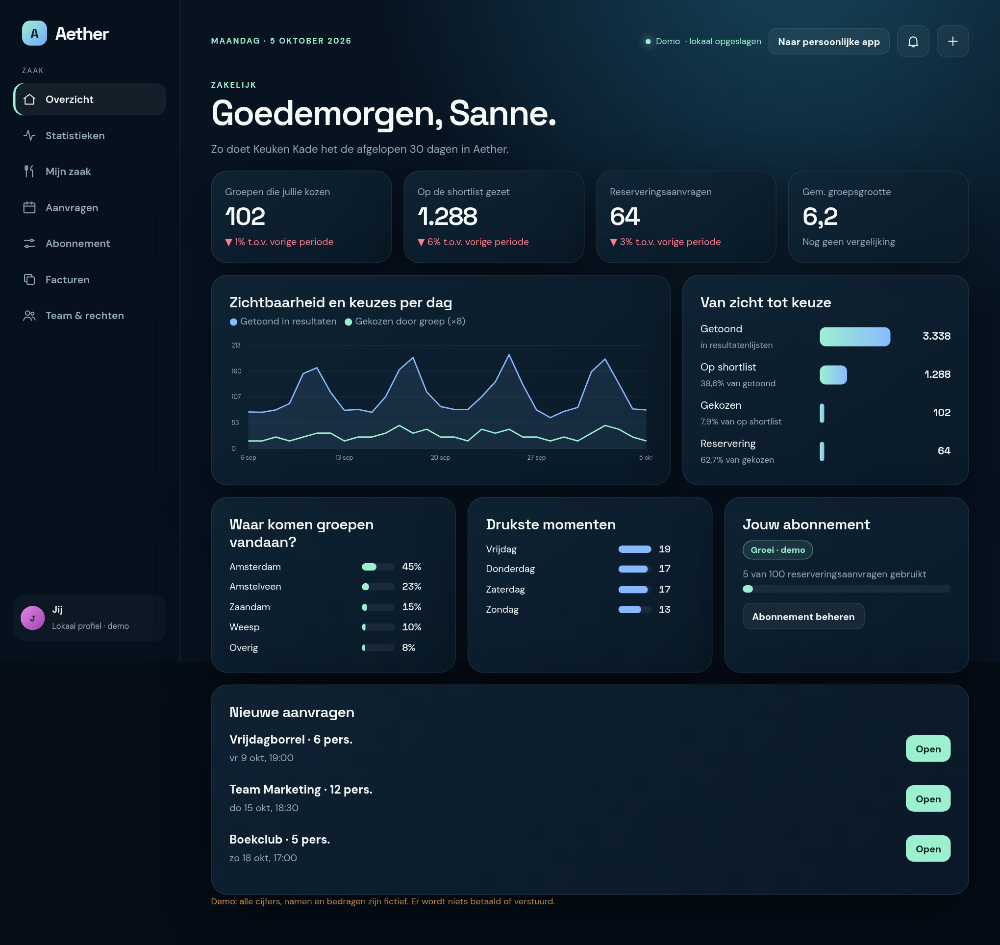

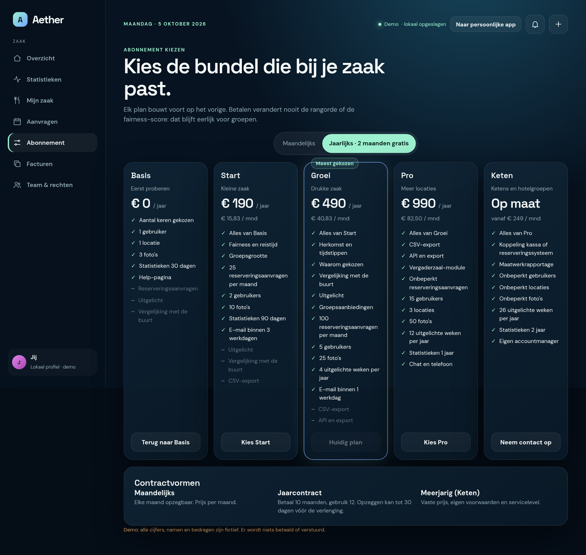

---

## Bijlage A — Overzicht screenshots

| Bestand | Scherm |
|---|---|
| `screenshots/01-onboarding.png` | Zaak aansluiten |
| `screenshots/02-overzicht.png` | Overzicht (computer) |
| `screenshots/10-mobiel.png` | Overzicht (telefoon) |
| `screenshots/03-statistieken.png` | Statistieken |
| `screenshots/04-mijn-zaak.png` | Mijn zaak |
| `screenshots/05-aanvragen.png` | Aanvragen |
| `screenshots/06-abonnement.png` | Abonnement |
| `screenshots/07-plannen.png` | Abonnement kiezen |
| `screenshots/08-facturen.png` | Facturen |
| `screenshots/09-team.png` | Team & rechten |

De mockups staan als HTML in `docs/zakelijk/mockups/` (openen via `npx serve .` → `/docs/zakelijk/mockups/02-overzicht.html`). Alle cijfers, namen en bedragen zijn fictief; "Keuken Kade" is een fictieve zaak uit de demo-data.
